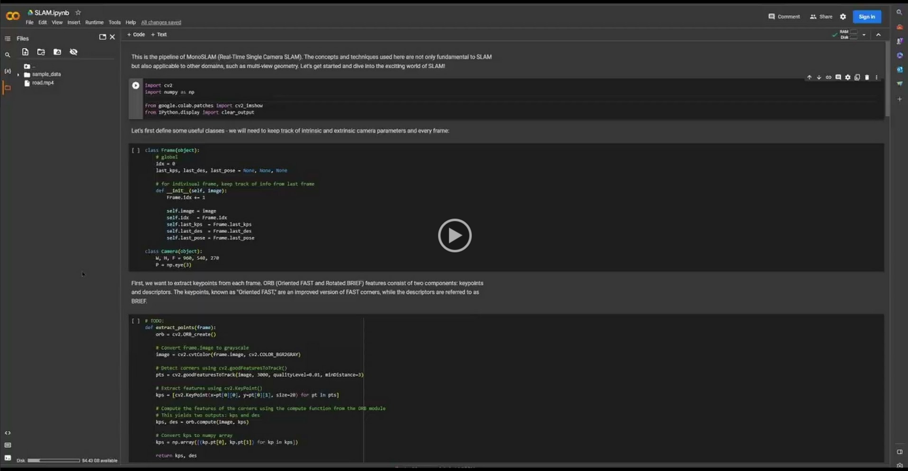
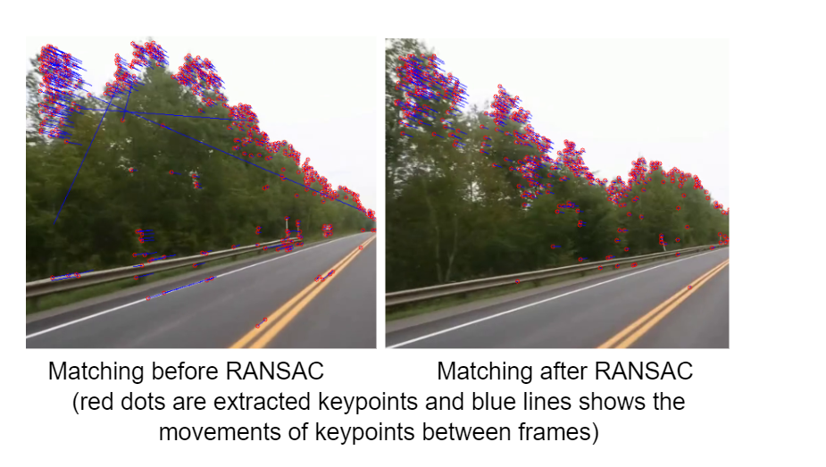

# Learn MonoSLAM in a CSE455 homework style

## Evan Zhao, University of Washington

### Video walk through

### Problem
We aim to further extend the course content to study SLAM based inside-out tracking systems by mimicking the assignments in this class. We have designed theoretical questions related to basic introduction to SLAM. Then we built the starter code to put the theory into practice. We designed a basic 2D SLAM program that guides students through the pipeline of MonoSLAM (Real-Time Single Camera SLAM). The concepts and techniques we ask students to implement here are not only fundamental to SLAM but also applicable to other domains, such as multi-view geometry. 

### Data used and preexisting work
We built the system based on the OpenCV libraries and its many powerful functions such as the cv2.goodFeaturesToTrack to find features in an image. We also searched through the Internet and found videos of a camera moving on an empty road, which helps us evalute the SLAM algorithm.

### The work we have done
We have carefully designed all the prompting questions and text blocks in the notebook, hoping to give a brief introduction to the algorithm and all the code we have written. It mimics the style of previous assignments, with the intent to guide through potential students using this project step by step. We also put together this very basic SLAM pipeline that not only uses knowledge that we had covered in the class, but also provides this comparison between non-optimized version and the RANSAC version. Last but not least, we put a lot of effort and created a set of conceptual questions that further extend the content to fully recontsruct the scene in 3D. The code for this section requires much more heavy libraries, but didn't give enough essential information on how to solve SLAM problems or how to use it. Thus we carefully picked the most informative and important parts in the mathematical derivations and made them theoretical questions.

### Implementation details
The monocular SLAM pipeline is divided into two distinct parts for this project: the programming part and the conceptual part.
In the programming part, the first section of code involves extracting keypoints from the input images and subsequently matching these keypoints between frames. This step is crucial for establishing correspondences and tracking features across consecutive frames.
Following the keypoint extraction and matching, the second part of the code aims to reduce noise in the matching process. This is achieved by implementing a simple RANSAC (Random Sample Consensus) algorithm. RANSAC helps to eliminate outliers and improve the accuracy of the matched keypoints, thereby enhancing the overall performance of the SLAM system.

Moving on to the conceptual questions part, we have carefully designed the structure following an actual MonoSLAM pipeline. We do not assume that students should have any prior knowledge on SLAM more than what was required in this class. Instead, we added detailed helper information along with each step in the derivation to walk students through step by step. Complicated mathematical calculations are omitted from the questions to ensure a reasonable difficulty level. Yet key derivations in the algorithm are presented and we believe students will benefit from them in many ways. For more information about the theoretical questions part, please refer to the PDF file named "Homework".
